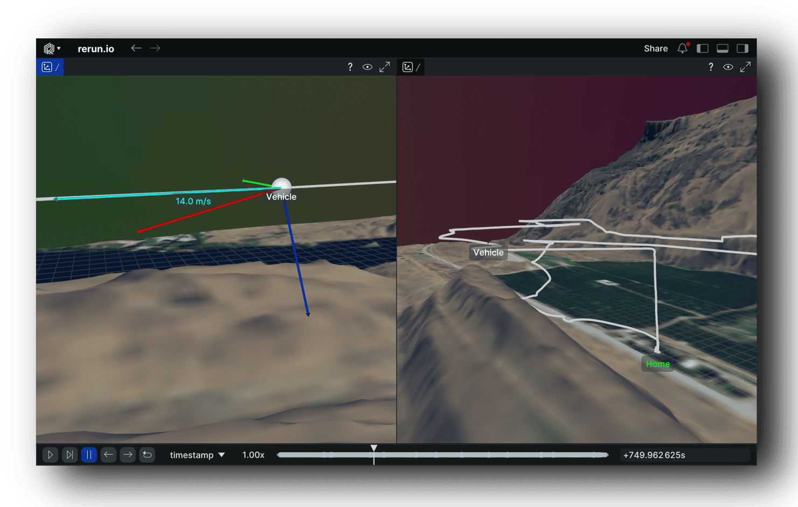
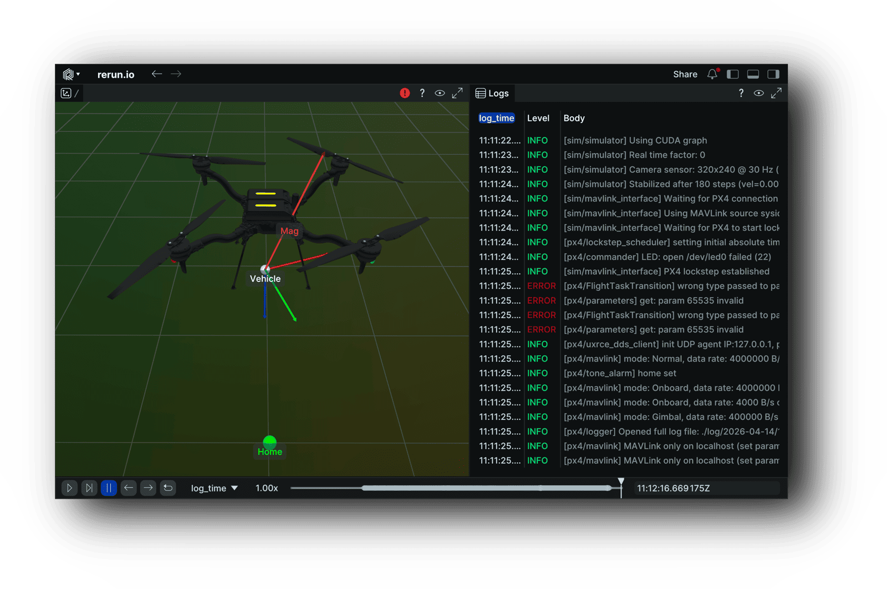
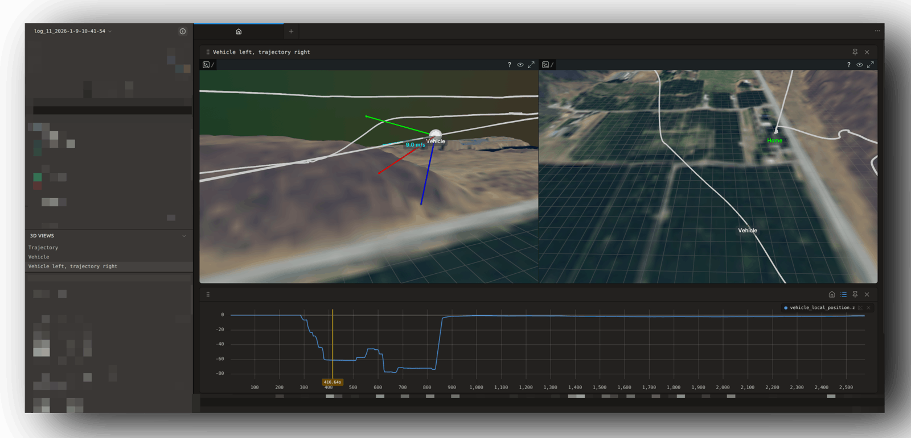

# px4-rerun

[](https://github.com/rerun-io/rerun)
[](https://github.com/breuerpeter/px4-rerun/actions/workflows/build.yml)
[](https://github.com/breuerpeter/px4-rerun/actions/workflows/pre-commit.yml)

C++ library for visualizing PX4 data with [Rerun](https://rerun.io)

## Gallery

ULog playback with the prebuilt [loader](#visualizing-ulog-files)


Logging live data from a PX4 SITL instance using the [library](#using-as-a-library)


ULog analysis web app using the Rerun web viewer for 3D visualization


## Visualizing ULog files

### Install prebuilt binary

Download the tarball from the [latest release](https://github.com/breuerpeter/px4-rerun/releases/latest) and extract to `~/.local`:

```bash
curl -sSL https://github.com/breuerpeter/px4-rerun/releases/latest/download/px4-rerun-linux-x86_64.tar.gz | tar xz -C ~/.local
```

The Rerun Viewer will auto-discover the loader at `~/.local/bin/rerun-loader-ulog`, letting you open `.ulg` files directly:

```bash
rerun flight.ulg
```

Optionally pass a [blueprint](blueprints/) to customize the viewer layout:

```bash
rerun flight.ulg ~/.local/share/px4-rerun/blueprints/vehicle.rbl
```

### Build from source

```bash
sudo apt-get install libproj-dev libtiff-dev libssl-dev # required by PX4_RERUN_TERRAIN build option
cmake -S . -B build && cmake --build build -j$(nproc)
```

Auto-installs the loader to `~/.local/bin/` and blueprints to `~/.local/share/px4-rerun/blueprints/`.

Build options:

| Option | Default | Description |
|---|---|---|
| `PX4_RERUN_LOADER` | `ON` | Build the loader and enable ULog parsing |
| `PX4_RERUN_TERRAIN` | `ON` | Fetch and show USGS terrain data (US only) |

## Using as a library

### FetchContent (recommended)

```cmake
include(FetchContent)
FetchContent_Declare(px4_rerun
    GIT_REPOSITORY https://github.com/breuerpeter/px4-rerun.git
    GIT_TAG v0.1.0)
FetchContent_MakeAvailable(px4_rerun)
target_link_libraries(my_target PRIVATE px4_rerun)
```

### Git submodule

```bash
git submodule add https://github.com/breuerpeter/px4-rerun.git
```

```cmake
add_subdirectory(px4-rerun)
target_link_libraries(my_target PRIVATE px4_rerun)
```

### API

```cpp
#include <px4_rerun/px4_rerun.hpp>

// Log data (examples)
px4_rerun::log_vehicle_pose(rec, timestamp_us, x, y, z, qw, qx, qy, qz);
px4_rerun::log_text(rec, timestamp_us, text, severity);
px4_rerun::log_scalar(rec, "timeseries/topic/field", timestamp_us, value);

// Or parse an entire ULog file at once
px4_rerun::log_ulog(rec, "flight.ulg");
```
